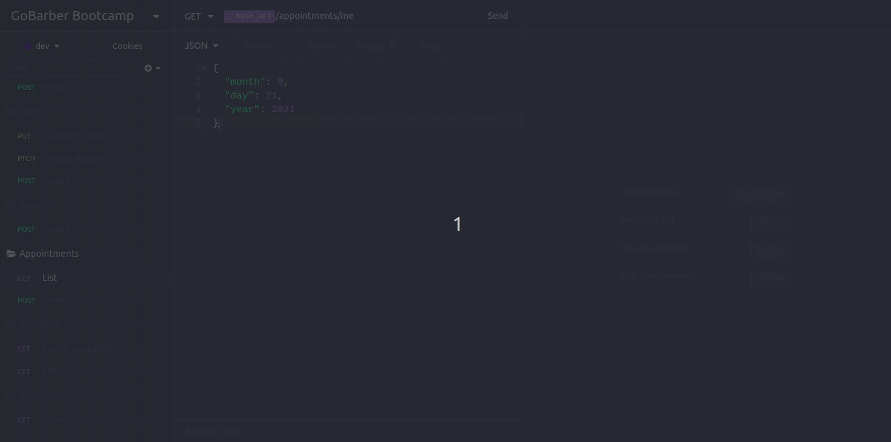

<h1 align="center">
    
</h1>

<h1 align="center">
    <strong>Principais Funcionalidades</strong>
</h1>

## Create User :

    
    
PostgreSQL Database - Users

    

## User Authentication :

    

## Create Appointment

    

## List Daily Appointments :

    

## List Users :

    

## Sending Forgot Password Email:

    

## 📖️ About

This is a **REST API** for the GoBarber application to create beard cutting schedules between the barber and the client.

## Implementation:

 <h3 align="center">
 - Databases
 </h3>
 For relationship between users, I used the PostgreSQL database. To save and list the error messages for Forgot Password requests I used the MongoDB database. to increase security and avoid Brute Force and DDoS attacks I used Redis database cache to control user access.

 <h3 align="center">
 - Domain Driver Design (DDD) & Test Driven Development (TDD)
 </h3>
I used the DDD Architecture Design Patterns and implemented TDD unit tests

## 🔨️ Tools

- [Node](https://nodejs.org/en/)
- [Express JS](https://expressjs.com/pt-br/)
- [Typescript](https://www.typescriptlang.org/)
- [PostgreSQL](https://www.postgresql.org/)
- [MongoDB](https://www.mongodb.com/1)
- [Redis](https://redis.io/)
- [Docker](https://www.docker.com/)
- [TypeORM](https://typeorm.io/#/)
- [ESlint](https://eslint.org/)
- [AWS S3 & AWS SES](https://aws.amazon.com/pt/)

